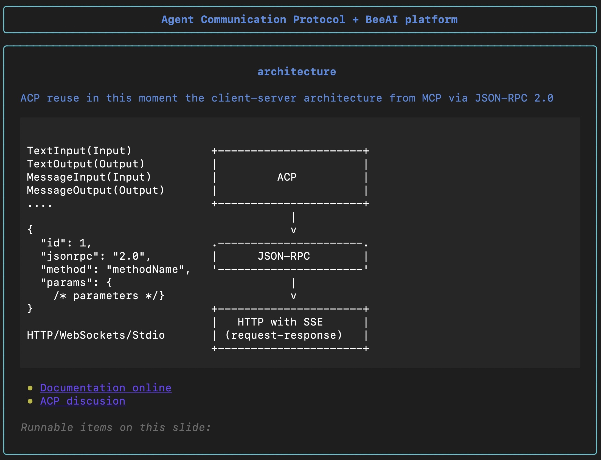

# ACP (Agent Communication Protocol) + BeeAI, AI Dev 25 Demo session
Slides in Markdown about the ACP and BeeAI presentation, AI Dev 25 

- [Slides](ACP+BeeAI.md) 

<p align="center">
  
</p>

## view it in your terminal

you can use [slides](https://github.com/maaslalani/slides) or [slid.py](https://github.com/ismaelfaro/slid.py)

```bash
slides ACP+BeeAI.md
```